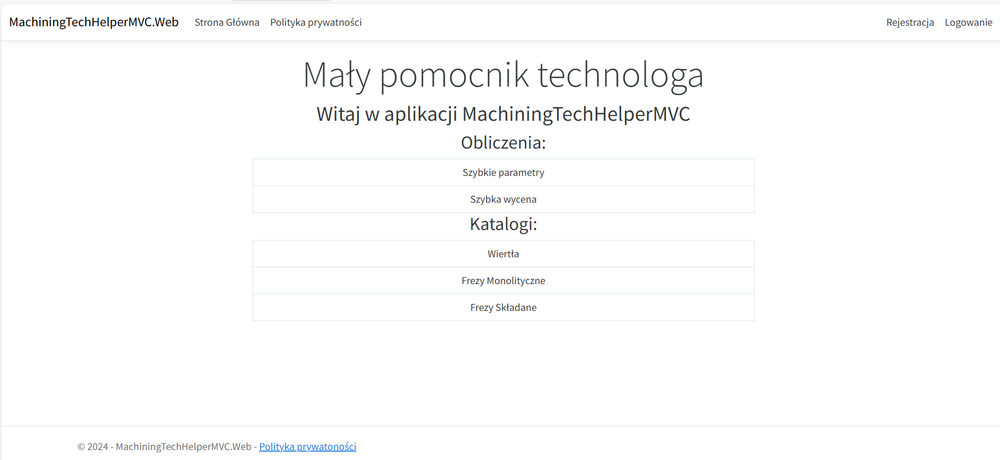
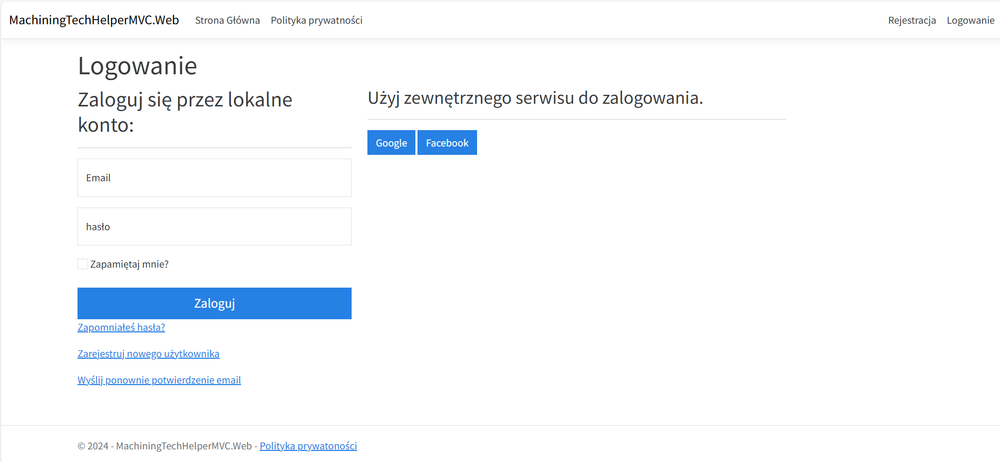
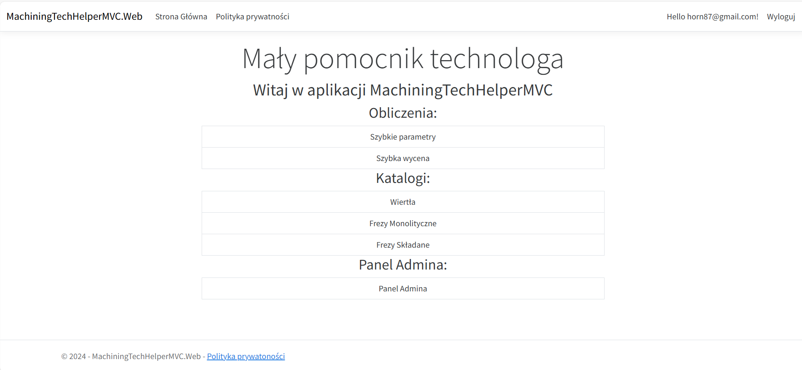
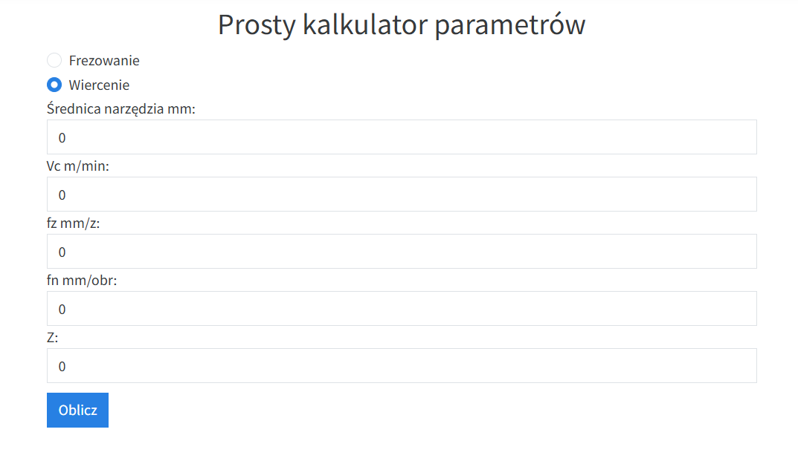
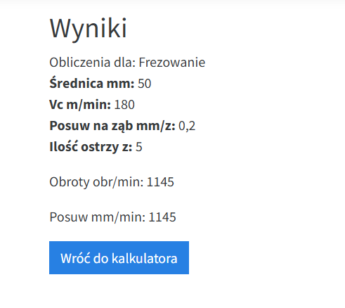
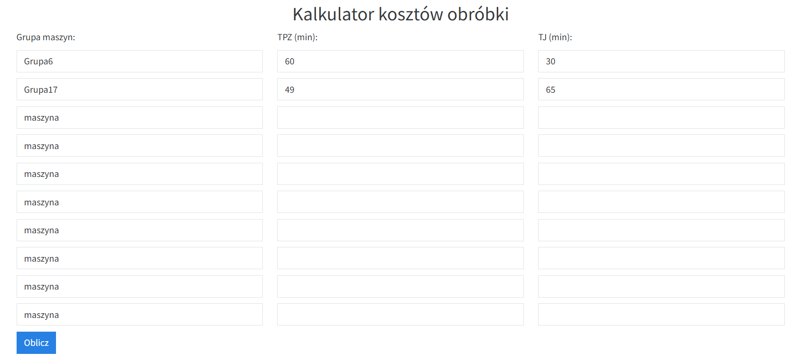
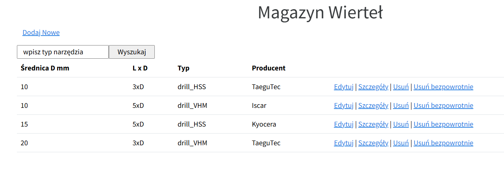
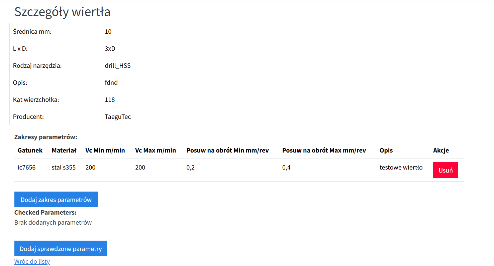

# MachiningTechHelperMVC

Web aplication for machining technologists. Components: Catalogue for storing parameters for machining tools (drills, endmills and solid endmills), simple parameters calculator and simple part cost calculator. Sections of applications are protected by user roles.

## Technologies used
* C#
* .NET 8
* ASP.NET Core
* Entity Framework Core
* SQL Server
* XUnit

## Instalation
1. Clone the repository
2. Update the `appsettings.json` file with your database connection string and authentication keys
3. Run the application

## Using The App
When the application launches it should look like this:

To get access to more options you need to login:

When loged as admin role the main page should look like this:

App includes simple calculator for machining parameters:

Another calculator included in app is machining cost calculator:

Application work with database to provide machining parameters catalogues for tools such as drills, mills and solid endmills:

